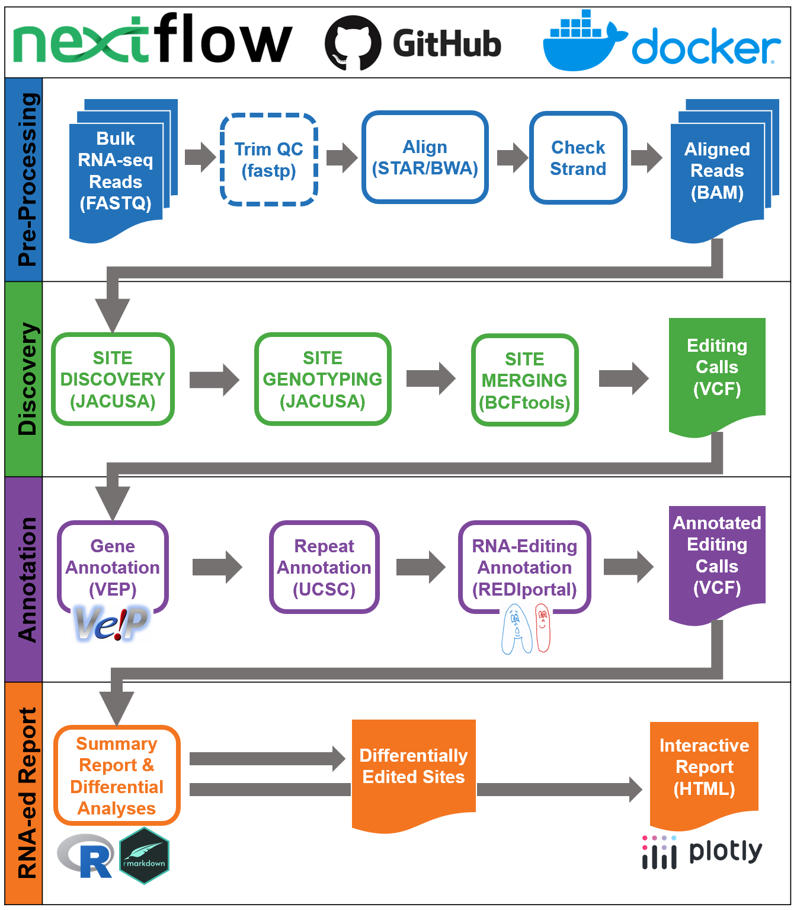

# Edi-Set-Flow - Detecting RNA editing at scale
A robust pipeline for RNA editing detection and differential analysis in bulk RNA-seq

## Overview
<p align="center"></p>

## Getting Started

### 1) Requirements
- [Nextflow](https://www.nextflow.io/) (≥ 22.03.0)
- Container engine, any of:
    - [Apptainer](https://apptainer.org/)
    - [Singularity](https://docs.sylabs.io/guides/3.5/user-guide/index.html)
    - [Docker](https://www.docker.com/)

### 2) Sample Manifest (CSV format)
- **Required Columns:**
    - "sample_id" (uniuqe identified for sample)
    - "fastq_1"
    - "fastq_2" (if paired-end)
    - "group" (experimental condition of interest)
- **Optional Columns:**
    - Arbitrary covariates to be include in GLM as fixed effects

### 3) Running

```{bash}
nextflow run bahlolab/Edi-Set-Flow \
    -r 25.07-beta.1 \
    -profile singularity \
    --input sample_manifest.csv \
    --fixed_effects sex,age \
    --outdir esf_results
```