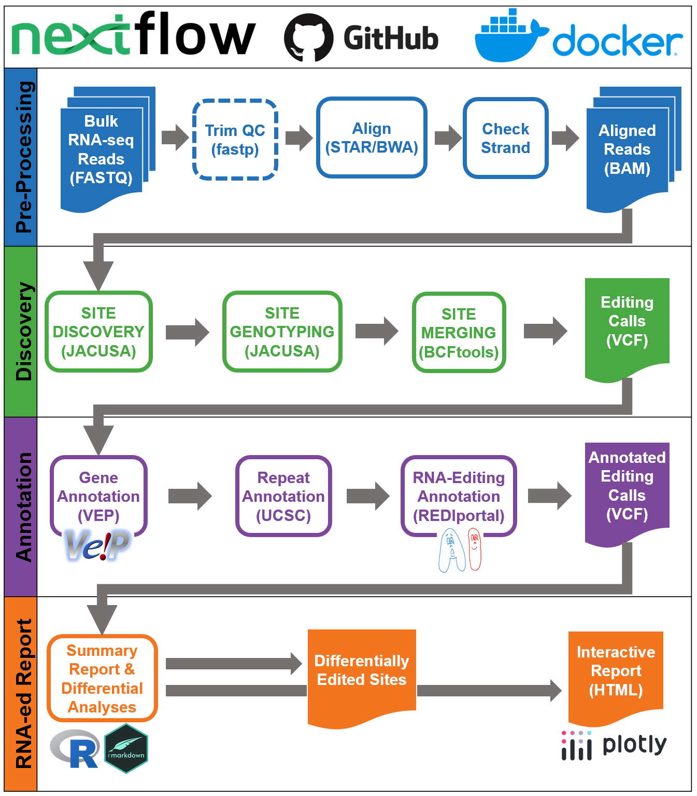

# Edi-Set-Flow - Detecting RNA editing at scale
A robust pipeline for RNA editing detection and differential analysis in bulk RNA-seq

> This is a beta release - please try it and report any issues here

## Overview
<p align="center"></p>

Edi-Set-Flow runs in five stages:

1. **Setup** — Downloads reference genome, GTF, REDIportal (hg38 only), and common variant exclusion lists (dbSNP/gnomAD), then builds aligner indices. All resources are cached in `esf_resources/` and reused across runs.
2. **Alignment** — Optionally trims reads with fastp, aligns to the reference (STAR or BWA-MEM2), filters BAMs, estimates per-sample coverage with mosdepth, and automatically detects library strandedness.
3. **Site Discovery & Counting** — JACUSA2 scans for candidate A-to-I (A>G) RNA editing sites in two passes: a loose discovery pass to identify candidate sites, followed by a stricter counting pass to quantify allele counts. Both passes run in parallel across genomic intervals.
4. **Annotation** — Ensembl VEP annotates variant consequences (gene, transcript, impact); vcfanno adds REDIportal catalog membership and repeat-masker context.
5. **Reporting & Statistics** — MultiQC aggregates alignment and QC metrics; the companion `edisetr` R package fits per-site GLMs across experimental groups and generates an interactive HTML report.

## Getting Started

### 1) Requirements
- [Nextflow](https://www.nextflow.io/) (≥ 22.03.0)
- Container engine, any of:
    - [Apptainer](https://apptainer.org/)
    - [Singularity](https://docs.sylabs.io/guides/3.5/user-guide/index.html)
    - [Docker](https://www.docker.com/)

### 2) Sample Manifest (CSV format)
- **Required Columns:**
    - `sample_id` — unique identifier for each sample
    - `group` — experimental condition used as the primary contrast in the GLM (e.g. tissue, treatment)
    - **One of** the following input options per sample:
        - `fastq1` (+ optional `fastq2`) — paths to local FASTQ files; omit `fastq2` or leave blank for single-end data
        - `run_accession` — SRA or ENA run accession (e.g. `SRR...`, `ERR...`); reads are downloaded automatically using `fasterq-dump`
- **Optional Columns:**
    - Arbitrary covariates to include in the GLM as fixed effects (specified via `--report_fixed_effects`)
    - Columns containing numbers are treated as numeric; all others are treated as factors
- **Example (local FASTQs):**
     ```
    sample_id,fastq1,fastq2,group,sex,age
    SRR1311086,/PATH/TO/SRR1311086_1.fastq.gz,/PATH/TO/SRR1311086_2.fastq.gz,cortex,male,50
    SRR1477080,/PATH/TO/SRR1477080_1.fastq.gz,/PATH/TO/SRR1477080_2.fastq.gz,cerebellum,female,60
    SRR1085825,/PATH/TO/SRR1085825_1.fastq.gz,/PATH/TO/SRR1085825_2.fastq.gz,hippocampus,male,50
    ...
    ```
- **Example (SRA/ENA accessions):**
     ```
    sample_id,run_accession,group,age
    SRR5961804,SRR5961804,CTRL,38
    SRR5961807,SRR5961807,CTRL,55
    SRR5961808,SRR5961808,MDD,38
    ...
    ```

### 3) Run Edi-Set-Flow
- **Example:**
    ```bash
    nextflow run bahlolab/Edi-Set-Flow \
        -revision 26.03-beta.2 \
        -profile hg38,singularity \
        -resume \
        --input sample_manifest.csv \
        --report_fixed_effects sex,age \
        --outdir esf_results
    ```
- **Quick test run:**

    The `test` profile provides a built-in manifest of 10 SRA samples (5 CTRL / 5 MDD, human prefrontal cortex). Reads are downloaded automatically via `fasterq-dump`, so no input files are needed:
    ```bash
    nextflow run bahlolab/Edi-Set-Flow \
        -revision 26.03-beta.2 \
        -profile hg38,singularity,test \
        -resume \
        --outdir esf_test_results
    ```

- **Notes**:
    - **Profiles**:
        - **Genome**: `hg38`, `mm10` or `mm39` are supported. Other genome builds require custom specification — see `nextflow.config`
        - **Container Engine**: `singularity`, `apptainer`, or `docker`
        - **Examples**: `-profile hg38,singularity` or `-profile mm10,docker`
    - Resources (e.g. reference genome) are downloaded and stored in `esf_resources/`; use `--resource_dir /path/to/resource_dir` to share a single cache across multiple runs or users
    - REDIportal annotation is only supported for `hg38`

## Parameters

Key parameters grouped by function. Defaults are set by the `-profile` where noted.

### Input / Output

| Parameter | Default | Description |
|-----------|---------|-------------|
| `--input` | required | Path to sample manifest CSV |
| `--outdir` | `output` | Directory for pipeline outputs |
| `--resource_dir` | `esf_resources` | Reference data cache directory; share across runs to avoid re-downloading |

### Preprocessing

| Parameter | Default | Description |
|-----------|---------|-------------|
| `--aligner` | `BWAMEM2` | Aligner to use: `BWAMEM2` or `STAR`. STAR is recommended when splice-aware alignment is important |
| `--fastp_mode` | off | Read QC/trimming: omit to skip, `MINIMAL` (adapter trimming only), `STRICT` (quality filtering + adapter trimming) |
| `--drop_duplicates` | `true` | Remove PCR duplicates from BAMs before site detection |

### Site Detection

| Parameter | Default | Description |
|-----------|---------|-------------|
| `--min_mapq` | `20` | Minimum mapping quality passed to JACUSA2 |
| `--infer_enzyme` | `true` | Infer editing enzyme type from data (ADAR: A>G; APOBEC: C>T) |
| `--n_intervals` | `10` | Number of genomic intervals for parallelisation — increase for larger datasets or more available CPUs |

### GLM / Report

| Parameter | Default | Description |
|-----------|---------|-------------|
| `--report_fixed_effects` | — | Comma-separated covariate columns from the manifest to include in the GLM (e.g. `sex,age`). `group` is always included automatically |
| `--report_model` | `quasibinomial` | GLM family: `quasibinomial` (recommended — handles overdispersion), `binomial`, `linear`, or `arcsine` |
| `--report_min_med_dp` | `10` | Minimum median depth across samples for a site to appear in the report |
| `--report_adar_only` | `true` | Restrict the report to A>G (ADAR-type) sites only |

## Output Files

| File | Description |
|------|-------------|
| **`EdiSetFlow.report.html`** | Interactive Edi-Set-Flow HTML report &mdash; [see example (GTEx brain)](https://bahlolab.github.io/Edi-Set-Flow/) |
| **`EdiSetFlow.sample_counts.csv.gz`** | Reference and alternate allele counts per site and sample |
| **`EdiSetFlow.sample_summary.csv.gz`** | Summary statistics (median depth & editing rate) per sample |
| **`EdiSetFlow.site_summary.csv.gz`** | Per-site statistics and annotation (e.g. gene, region, REDIportal membership, VEP consequence) |
| **`EdiSetFlow.glm_summary.csv.gz`** | GLM coefficients, standard errors, and significance per site |
| **`EdiSetFlow.glm_anova.csv.gz`** | ANOVA test results for each model term per site |
| **`EdiSetFlow.glm_contrasts.csv.gz`** | Pairwise group comparisons for differential editing |
| **`EdiSetFlow.glm_margins.csv.gz`** | Estimated marginal editing rates per group |
| **`multiqc_report.html`** | MultiQC summary report (fastp, STAR/BWA-MEM2, mosdepth, etc.) |

## Running on HPC & Cloud

Nextflow handles job submission and resource management, but a few settings are worth configuring for cluster or cloud environments.

**Executor (SLURM, PBS, AWS, etc.)**

By default Nextflow runs processes locally. To submit jobs to a cluster scheduler or cloud provider, add an executor block to a local `nextflow.config` in your working directory, or pass it with `-c custom.config`:

```groovy
process {
    executor = 'slurm'       // or 'pbspro', 'awsbatch', 'google-lifesciences', etc.
    queue    = 'your-queue'
}
```

See the [Nextflow executor documentation](https://www.nextflow.io/docs/latest/executor.html) for all supported platforms and options.

**Overriding CPU / Memory per Process**

Each tool runs under a named label (e.g. `jacusa2`, `star`, `vep`). Override resources for any label in your config:

```groovy
process {
    withLabel: 'jacusa2' { cpus = 16; memory = '80 GB' }
    withLabel: 'star'    { cpus = 8;  memory = '40 GB' }
}
```

**Resuming Failed Runs**

Always pass `-resume` when restarting a run. Nextflow caches completed tasks and will skip them, restarting only from the point of failure.

**Container Cache**

Set the appropriate environment variable so containers are pulled once and shared across runs:

```bash
export NXF_APPTAINER_CACHEDIR=/shared/path/apptainer_cache   # Apptainer / Singularity
export NXF_SINGULARITY_CACHEDIR=/shared/path/singularity_cache
```

**Sharing Reference Resources**

Pass `--resource_dir /shared/path/esf_resources` to point all runs at a shared reference cache, avoiding repeated downloads of the genome, GTF, and annotation databases.

**Getting Help**

- Nextflow documentation: [nextflow.io/docs](https://www.nextflow.io/docs/latest/)
- Pipeline issues and questions: [GitHub Issues](https://github.com/bahlolab/Edi-Set-Flow/issues)

## References
> **Piechotta, M., Naarmann-de Vries, I. S., Wang, Q., Altmüller, J. & Dieterich, C. (2022)**
> _RNA modification mapping with JACUSA2._
> _Genome Biology_, **23**(1), 115.

> **D'Addabbo, P., Cohen-Fultheim, R., Twersky, I., Fonzino, A., Silvestris, D. A., Prakash, A., … & Picardi, E. (2025)**
> _REDIportal: toward an integrated view of the A-to-I editing._
> _Nucleic Acids Research_, **53**(D1), D233–D242.

> **McLaren, W., Gil, L., Hunt, S. E., Riat, H. S., Ritchie, G. R., Thormann, A., … & Cunningham, F. (2016)**
> _The Ensembl Variant Effect Predictor._
> _Genome Biology_, **17**, 1–14.

> **da Veiga Leprevost, F., Grüning, B. A., Alves Aflitos, S., Röst, H. L., Uszkoreit, J., Barsnes, H., … & Perez-Riverol, Y. (2017)**
> _BioContainers: an open-source and community-driven framework for software standardization._
> _Bioinformatics_, **33**(16), 2580–2582.

> **Di Tommaso, P., Chatzou, M., Floden, E. W., Barja, P. P., Palumbo, E. & Notredame, C. (2017)**
> _Nextflow enables reproducible computational workflows._
> _Nature Biotechnology_, **35**(4), 316–319.
